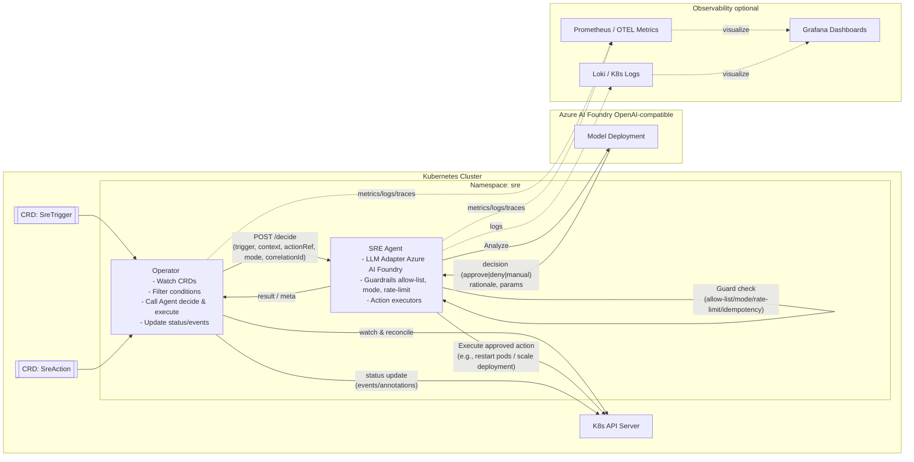

# SRE Agent for Kubernetes (Sketch)


> *   구성요소: **Operator (Go)** + **SRE Agent (Python)**
> *   목적: K8s 상태/이벤트를 Operator가 감지 → **SRE Agent**에 의사결정 위임 → **LLM(Azure AI Foundry / OpenAI 호환)** 기반 분석/추천/승인 → **안전 가드** 하에 자동/반자동 시정 조치


## 1) Architecture (개념)

High Level Design




## 2) Dev Environment (개발 환경 설정)

### 필수 도구

*   **Docker**, **kubectl**(1.29+), **kind** (또는 k3d/minikube)
*   **Go 1.22+** (Operator)
*   **Python 3.11+** (Agent)
*   (권장) **make**, **k9s**, **stern**, **jq**
*   **VS Code** + 확장(아래 “코딩 컨벤션 & VS Code 자동화” 참고)


## 3) Local Development (컴포넌트별)

### Operator (Go)

*   역할: **CRD Watch → 간단 조건 확인 → Agent에 `/decide` 요청 → (승인 시) `/execute` → 결과 반영**
*   로컬 실행: TBD...

### SRE Agent (Python)

*   역할: **LLM 기반 분석/추천/승인 결정**, **액션 실행**, **가드(allow-list, mode, rate-limit, idempotency)** 적용
*   로컬 실행: TBD...

## 4) Team Coding Conventions

> 목표: **“설치하면 바로 일관성 유지”**. 팀 합의가 필요한 규칙은 최소로 두고, VS Code 확장과 설정으로 자동화.

### 추천 VS Code 확장 (추천 리스트)

*   **Python**: `ms-python.python`, `ms-python.black-formatter`, `charliermarsh.ruff`
*   **Go**: `golang.go` (gopls/gofmt/goimports 통합), `golangci-lint` (있으면 사용)
*   **YAML/Kubernetes**: `redhat.vscode-yaml`, `ms-kubernetes-tools.vscode-kubernetes-tools`
*   **일반 품질/편의**: `esbenp.prettier-vscode`, `EditorConfig.EditorConfig`, `eamodio.gitlens`, `github.vscode-pull-request-github`, `foxundermoon.shell-format`

> **권장 파일**: `.vscode/extensions.json` 를 나중에 추가

```json
{
  "recommendations": [
    "ms-python.python",
    "ms-python.black-formatter",
    "charliermarsh.ruff",
    "golang.go",
    "redhat.vscode-yaml",
    "ms-kubernetes-tools.vscode-kubernetes-tools",
    "EditorConfig.EditorConfig",
    "eamodio.gitlens",
    "github.vscode-pull-request-github"
  ]
}
```

### VS Code 기본 설정(권장 스니펫)

> **권장 파일**: `.vscode/settings.json` 를 나중에 추가

```json
{
  "files.trimTrailingWhitespace": true,
  "files.insertFinalNewline": true,
  "editor.formatOnSave": true,
  "editor.codeActionsOnSave": {
    "source.fixAll": "always",
    "source.organizeImports": "always"
  },

  // Python
  "python.defaultInterpreterPath": "python",
  "python.analysis.typeCheckingMode": "basic",
  "python.formatting.provider": "black",
  "[python]": {
    "editor.defaultFormatter": "ms-python.black-formatter"
  },
  "ruff.lint.args": ["--select=E,F,I,B"],
  "ruff.fixAll": true,

  // Go
  "go.useLanguageServer": true,
  "go.formatTool": "gofmt",
  "go.toolsManagement.autoUpdate": true,
  "go.lintTool": "golangci-lint",

  // YAML & K8s
  "yaml.format.enable": true,
  "yaml.validate": true,
  "yaml.schemas": {
    "kubernetes": [
      "deploy/**/*.yaml",
      "deploy/**/crds/*.yaml"
    ]
  }
}
```

### 공통 코딩 규칙(요약)

*   **커밋 메시지**: Conventional Commits (`feat:`, `fix:`, `docs:`, `refactor:`, `chore:`, `ci:`)
*   **로그 키 일관성**: `component`, `correlationId`, `namespace(ns)`, `resource(name)`
*   **예외/에러**: 원인 보존(Go: `%w`로 래핑), 사용자 메시지와 내부 스택 분리
*   **문서 우선**: 기능/행동 변경 시 **README 해당 섹션** 동반 갱신
*   **시크릿/키**: 커밋 금지. `.env`/로컬 값은 `.gitignore` 유지


## 5) Git Workflow (가이드)

**브랜치 모델 (Trunk-based 권장)**

*   `main`: 보호 브랜치(항상 배포 가능 상태 유지)
*   작업 브랜치: `feat/<short-desc>`, `fix/<short-desc>`
*   필요 시 릴리스 브랜치: `release/x.y`

**PR 원칙**

*   **스몰 PR**(리뷰 ≤ \~300라인) & 1 목적
*   PR 제목: Conventional Commits 활용
    *   예: `feat(operator): wire trigger-to-agent decision path`
*   체크리스트(권장):
    *   변경 요약 / 테스트 범위 / 리스크 / **README 갱신 여부** / 시크릿 미포함
*   보호 규칙: `main`에 직접 푸시 금지, **CI(린트/테스트) 통과 필수**

**버전/릴리스**

*   **SemVer**: `v0.x`
*   태그: `v0.1.0`부터 시작
*   GitHub Actions/Release 자동화는 추후 도입

## 6) 환경 변수 & 설정

TBD...


## 7) Repo Layout 

    sre-agent/
    ├─ operator/   # 독립 Go 모듈
    ├─ agent/      # 독립 Python 모듈
    └─ shared/     # 공통 스펙/문서/샘플

